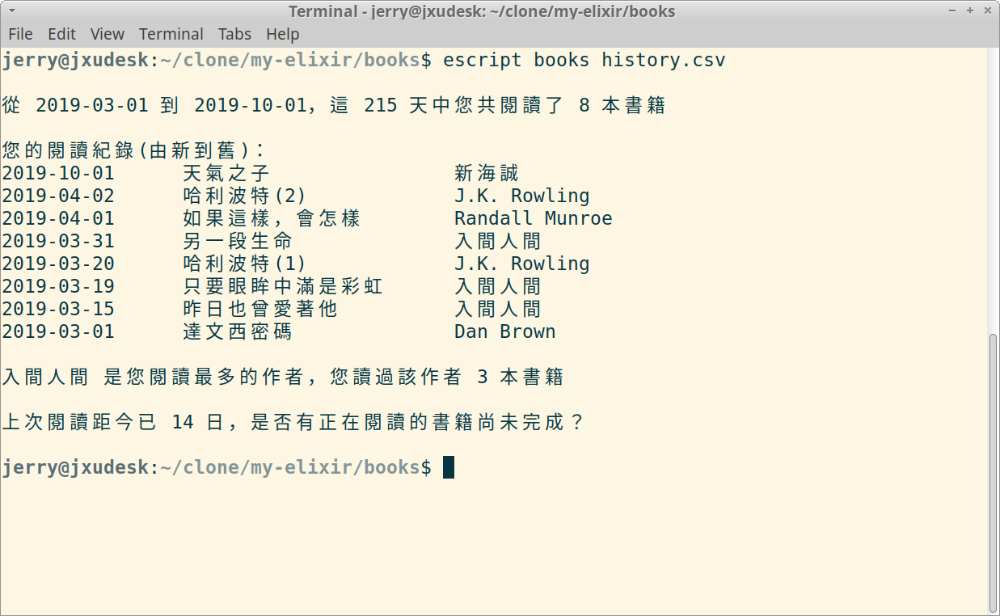

# Books

用elixir寫的書單紀錄工具

這個程式用來顯示你的閱讀紀錄，並總結最常閱讀的作家與最後閱讀距今時間

  ## 書籍清單

  一份書單是一個csv檔案，包含了閱讀日期、書名、作者共三個欄位，每個欄位用半形逗號隔開，注意在書名中不可使用半形逗號。

  一個紀錄可以表示為

  ```
  date,book,author
  ```

  範例

  `可使用範例檔案 history.csv 測試`

  ```
  2019-03-01,達文西密碼,Dan Brown
  2019-03-15,昨日也曾愛著他,入間人間
  2019-03-20,哈利波特(1),J.K. Rowling
  ```

  ## Installation

  Download source from github repo

  ## Usage

  `escript books /path/to/file.csv`

  ## 執行結果

  > $ escript  books history.csv


